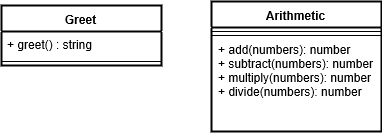

**Lab 01**

**Author: Sarkis Aghazarian**

**Links and Resources**

**Modules**

**greet.js**

**Exported Values and Methods**

`greet() -> string`

**arithmetic.js**

**Exported Values and Methods**

`add(...numbers) -> number`

`subtract(...numbers) -> number`

`multiply(...numbers) -> number`

`divide(...numbers) -> number`

**TESTS**

Please run with npm run test

